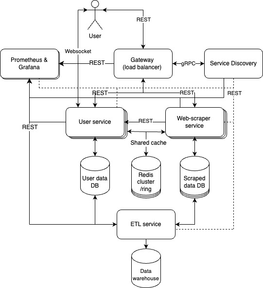

# Jobs Aggregator With Data Analysis Insights

## Theory
- **Circuit Breaker:** This is a design pattern used to stop repeated failures in a system, allowing it to recover when multiple reroutes occur.

- **Service High Availability:** This ensures that a service is consistently operational and available to users, minimizing downtime.

- **Logging with ELK or Prometheus and Grafana:** These are tools used for collecting and visualizing logs and metrics from all services in a system to monitor performance and troubleshoot issues.

- **2 Phase Commits:** This approach ensures that changes involving multiple databases are managed reliably by coordinating the commits in two phases, improving data consistency.

- **Consistent Hashing for Cache:** This technique distributes cache data across servers efficiently, ensuring that requests can be handled without overloading any single server.

- **Cache High Availability:** This refers to strategies that ensure cached data is always accessible, even if one or more cache instances fail.

- **Long-running Saga Transactions:** Instead of traditional two-phase commits, this method manages transactions that span multiple services by coordinating long-running processes to maintain consistency.

- **Database Redundancy/Replication:** This involves creating copies of a database to ensure data is not lost and can be quickly restored in case of failures.

- **Data Warehouse and ETL:** A data warehouse is a centralized repository for storing data from multiple databases, and ETL (Extract, Transform, Load) processes are used to update the warehouse regularly with data.


## Application Suitability
Why this application is relevant?
<br>
- Relevance of this app is determined by the lack of data insights (skills demand, average experience needed, salary expectations, etc.) about jobs on other similar platforms.
- It is more efficient and saves time when searching for jobs in only one place.
- Gives users confidence that they will not miss new opportunities as the app will aggregate jobs from multiple sources and notify users about them.

Why this application requires a microservice architecture?
- There are multiple platforms from where to gather data, which means multiple web-scrapers, thus, microservices.
- Need in a service for answering user requests like login, subscription to specific job types, searching jobs data, processing and generating data insights based on the scraped data.
- Similar platforms that employ microservices and are similar to the mentioned idea are LinkedIn, Indeed, and Glassdoor.

## Service Boundaries
- Web-scrapers service
    - extracts data from websites;
    - refines extracted data;
    - saves the data to the database;
- User service
    - authentication;
    - subscription;
    - jobs search;
    - jobs data processing and insights generation;
    - the last can save the generated insights in a cache db like redis;


<br>
<b>Figure 1.</b> Simple system architecture diagram

## Technology Stack and Communication Patterns
- Web-scraper service
    - Python (BeautifulSoup4/Selenium)
    - PostgreSQL (with SQLAlchemy and TCP)
- User service
    - Python (RESTful API with Flask)
    - PostgreSQL (with SQLAlchemy)
    - Redis
    - Websocket (websockets library)
- Gateway
    - JavaScript (RESTful API with Express.js)
- Service Discovery
    - JavaScript (gRPC and Express.js)
- ELK stack
    - Python (Flask)
- ETL service
    - Python (Flask)

## Data Management
How data is managed across microservices?
- Web-scrapers will extract and save jobs data in a database;
- User service will access and process the data from the web-scrapers' database;
- User data will be saved and fetched from another user specific database;
- Redis will save already generated insights when users search for jobs;

All endpoints:
```
endpoint: "/sign-up",
method: "POST",
received_data: json {
    "name": "string",
    "email": "string",
    "password": "string"
},
responses:
    201: json {"msg": "Successful sign up", "websocket": "ws_url"},
    400: json {"msg": "Invalid email"},
    400: json {"msg": "Password too short"}


endpoint: "/login",
method: "POST",
received_data: json {
    "email": "string",
    "password": "string"
},
responses:
    200: json {"msg": "Successful login", "websocket": "ws_url"},
    401: json {"msg": "Invalid email or password"}


endpoint: "get-subscriptions/<user_id>",
method: "GET",
received_data: path parameter
    "user_id": "integer"
responses:
    200: json {"skills": ["skill1", "skill2"]},
    404: json {"msg": "No skills"}


endpoint: "/find-jobs",
method: "GET",
received_data: query parameters
    "title": "string",
responses:
    200: json [
        {
            "job_id": "string",
            "title": "string",
            "company": "string",
            "location": "string",
            "description": "string",
            "date_posted": "string"
        }
    ],
    404: json {"msg": "No jobs found"}


endpoint: "/generate-insight-skills-by-demand/{keywords}",
method: "GET",
received_data: path parameter
    "keywords": "string"
response:
    200: json {
        ["string", "integer"]
    }


endpoint: "/generate-insight-average-experience/{keywords}",
method: "GET",
received_data: path parameter 
    "keywords": "string"
response:
    200: json {
        "average_experience": "integer"
    }


endpoint: "/skills-by-salary"
method: "GET",
response:
    200: json {
        "skill": "salary"
    }

endpoint: "/average-job-salary"
method: "GET",
response:
    200: json {
        "average_salary": "float"
    }

endpoint: "/all-skills-by-demand"
method: "GET",
response:
    200: json {
        "skill": "demand"
    }

endpoint: "/status",
method: "GET",
response:
    200: json {"msg": "string" // status of the service"}
```

## Deployment and Scaling
Deployment is going to be achieved by creating containers with Docker and using Docker compose for management and scaling.
Example docker file:
```
FROM python:3.12-alpine
WORKDIR /app
COPY requirements.txt .
RUN pip install --trusted-host pypi.python.org -r requirements.txt
COPY . .
ENTRYPOINT ["python", "app.py"]
```

Example docker compose file:
```
services:
  web:
    build: .
    ports:
      - "8000:5000"
  redis:
    image: "redis:alpine"
```

## Run/deploy/test the project
- git clone https://github.com/Frunnze/jobs-aggregator-with-data-analysis-insights
- cd jobs-aggregator-with-data-analysis-insights
- docker compose up --build
- import pad-lab.postman_collection in postman
- The first endpoint to access is "/sign-up".