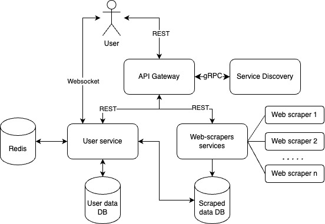

# Jobs Aggregator With Data Analysis Insights

## Application Suitability
Why this application is relevant?
<br>
- Relevance of this app is determined by the lack of data insights (skills demand, average experience needed, salary expectations, etc.) about jobs on other similar platforms.
- It is more efficient and saves time when searching for jobs in only one place.
- Gives users confidence that they will not miss new opportunities as the app will aggregate jobs from multiple sources and notify users about them.

Why this application requires a microservice architecture?
- There are multiple platforms from where to gather data, which means multiple web-scrapers, thus, microservices.
- Need in a service for answering user requests like login, subscription to specific job types, searching jobs data, processing and generating data insights based on the scraped data.
- Similar platforms that employ microservices and are similar to the mentioned idea are LinkedIn, Indeed, and Glassdoor.

## Service Boundaries
- Web-scrapers service
    - extracts data from websites;
    - refines extracted data;
    - saves the data to the database;
- User service
    - authentication;
    - subscription;
    - jobs search;
    - jobs data processing and insights generation;
    - the last can save the generated insights in a cache db like redis;


<br>
<b>Figure 1.</b> Simple system architecture diagram

## Technology Stack and Communication Patterns
- Web-scraper service
    - Python (BeautifulSoup4/Selenium)
    - PostgreSQL (with SQLAlchemy and TCP)
- User service
    - Python (RESTful API with Flask)
    - PostgreSQL (with SQLAlchemy)
    - Redis
    - Websocket (websockets library)
- Gateway
    - JavaScript (RESTful API with Express.js)

## Data Management
How data is managed across microservices?
- Web-scrapers will extract and save jobs data in a database;
- User service will access and process the data from the web-scrapers' database;
- User data will be saved and fetched from another user specific database;
- Redis will save already generated insights when users search for jobs;

All endpoints:
```
endpoint: "/sign-up",
method: "POST",
received_data: json {
    "name": "string",
    "email": "string",
    "password": "string"
},
responses:
    201: json {"msg": "Successful sign up"},
    400: json {"msg": "Invalid email"},
    400: json {"msg": "Password too short"}


endpoint: "/login",
method: "POST",
received_data: json {
    "email": "string",
    "password": "string"
},
responses:
    200: json {"msg": "Successful login"},
    401: json {"msg": "Invalid email or password"}


endpoint: "/find-jobs",
method: "GET",
received_data: query parameters
    "keywords": "string",
    "page": "integer",
    "per_page": "integer"
responses:
    200: json [
        {
            "job_id": "string",
            "title": "string",
            "company": "string",
            "location": "string",
            "description": "string",
            "date_posted": "string"
        }
    ],
    404: json {"msg": "No jobs found"}


endpoint: "/generate-insight-skills-by-demand/{keywords}",
method: "GET",
received_data: path parameter
    "keywords": "string"
response:
    200: json {
        "skill_name": "integer"
    }


endpoint: "/generate-insight-average-experience/{keywords}",
method: "GET",
received_data: path parameter 
    "keywords": "string"
response:
    200: json {
        "average_experience": "integer"
    }


endpoint: "/subscribe/{tag}",
method: "POST",
received_data: path parameter
    "tag": "string"
response:
    200: json {"msg": "string" // websocket address}


endpoint: "/status",
method: "GET",
response:
    200: json {"msg": "string" // status of the service"}
```

## Deployment and Scaling
Deployment is going to be achieved by creating containers with Docker and using Docker compose for management and scaling.
Example docker file:
```
FROM python:3.12-alpine
WORKDIR /app
COPY requirements.txt .
RUN pip install --trusted-host pypi.python.org -r requirements.txt
COPY . .
ENTRYPOINT ["python", "app.py"]
```

Example docker compose file:
```
services:
  web:
    build: .
    ports:
      - "8000:5000"
  redis:
    image: "redis:alpine"
```